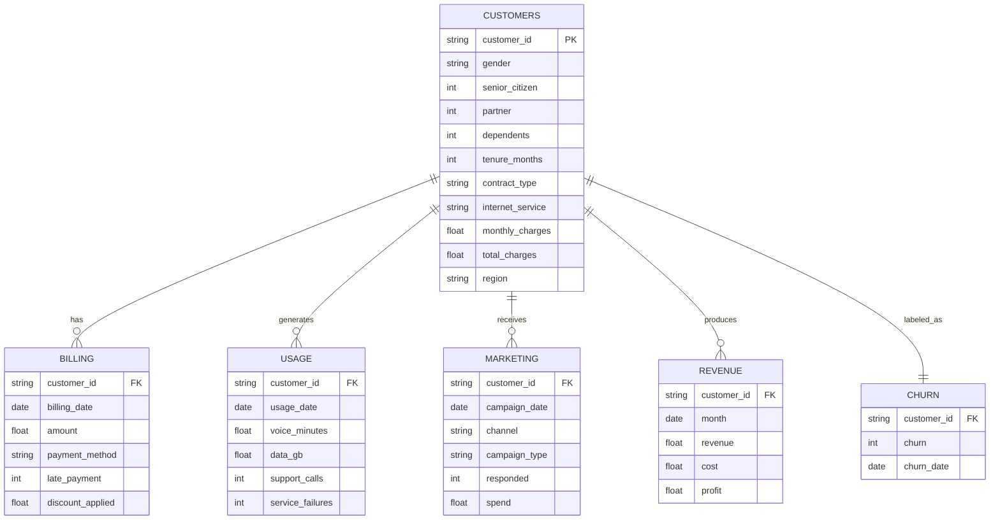

# 📊 Data Model & Entity Diagram

## Entity Relationship Diagram



## Data Pipeline Architecture

```
┌─────────────┐    ┌─────────────┐    ┌─────────────┐    ┌─────────────┐
│    RAW      │───▶│   BRONZE    │───▶│   SILVER    │───▶│    GOLD     │
│   (CSV)     │    │ (Parquet)   │    │ (Cleaned)   │    │ (Features)  │
└─────────────┘    └─────────────┘    └─────────────┘    └─────────────┘
      │                    │                  │                  │
   Validate           Deduplicate        Aggregate         Feature Eng
   Schema             Type Convert       Join Tables       Target Encode
   Quality            Partition          Handle Missing    Scale/Normalize
```

## Schema Definitions

### Bronze Layer (Raw Data)
- **Format**: Parquet
- **Partitioning**: None
- **Validation**: Schema enforcement
- **Retention**: 2 years

### Silver Layer (Cleaned Data)
- **Format**: Parquet
- **Partitioning**: By date
- **Validation**: Data quality rules
- **Retention**: 1 year

### Gold Layer (Feature Store)
- **Format**: Parquet
- **Partitioning**: By customer_id hash
- **Validation**: Feature drift monitoring
- **Retention**: 6 months

## Data Quality Rules

| Table | Rule | Threshold |
|-------|------|-----------|
| customers | customer_id uniqueness | 100% |
| customers | tenure_months >= 0 | 100% |
| billing | amount > 0 | 95% |
| usage | data_gb >= 0 | 100% |
| churn | churn in [0,1] | 100% |

## Feature Engineering Pipeline

```python
# Demographic Features
- contract_encoded: LabelEncoder(contract_type)
- is_senior: senior_citizen == 1
- has_partner: partner == 1
- has_dependents: dependents == 1

# Billing Features (12-month aggregations)
- avg_monthly_charge: mean(monthly_charges)
- billing_volatility: std(monthly_charges)
- late_payment_rate: sum(late_payments) / count(*)
- discount_frequency: sum(discount_applied > 0) / count(*)

# Usage Features
- avg_voice_minutes: mean(voice_minutes)
- data_usage_trend: slope(data_gb over time)
- support_call_frequency: sum(support_calls) / tenure_months
- service_reliability: 1 - (sum(service_failures) / count(*))

# Marketing Features
- campaign_response_rate: sum(responded) / count(*)
- preferred_channel: mode(channel)
- marketing_spend_per_customer: sum(spend) / count(*)

# Revenue Features (CLV)
- total_revenue: sum(revenue)
- revenue_trend: slope(revenue over time)
- profit_margin: mean(profit / revenue)
- monthly_revenue_volatility: std(revenue)
```